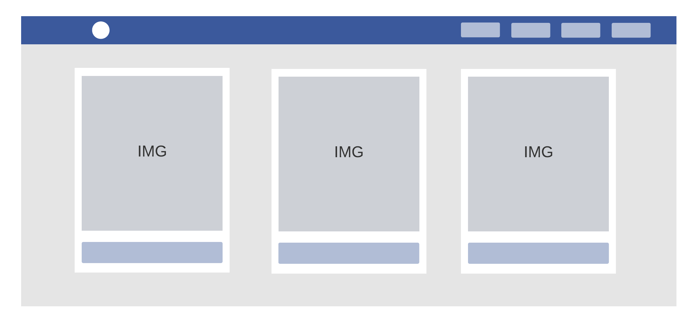
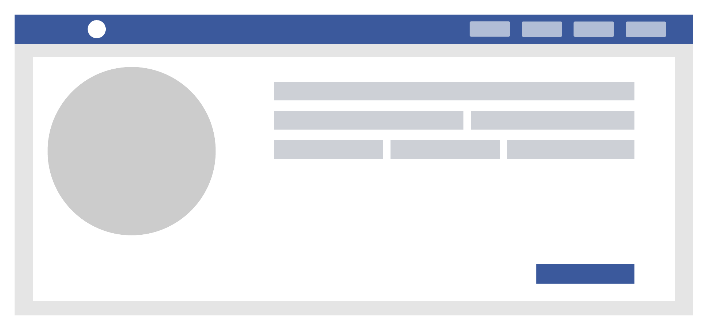
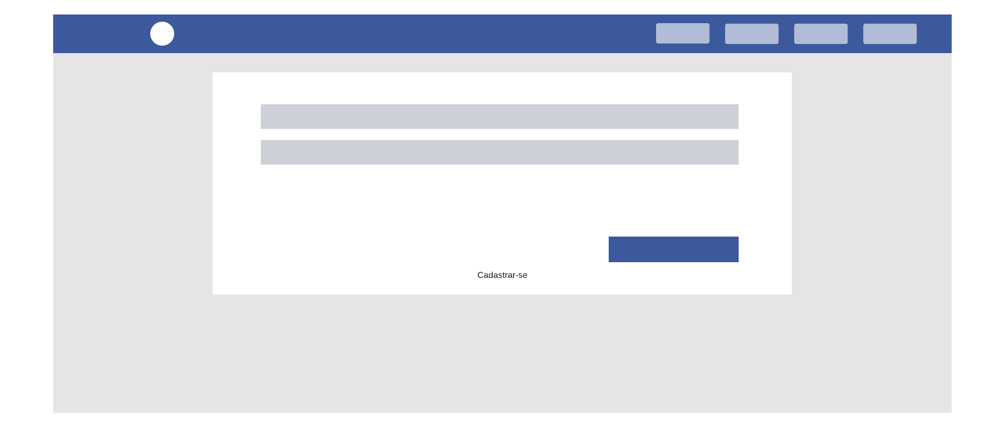
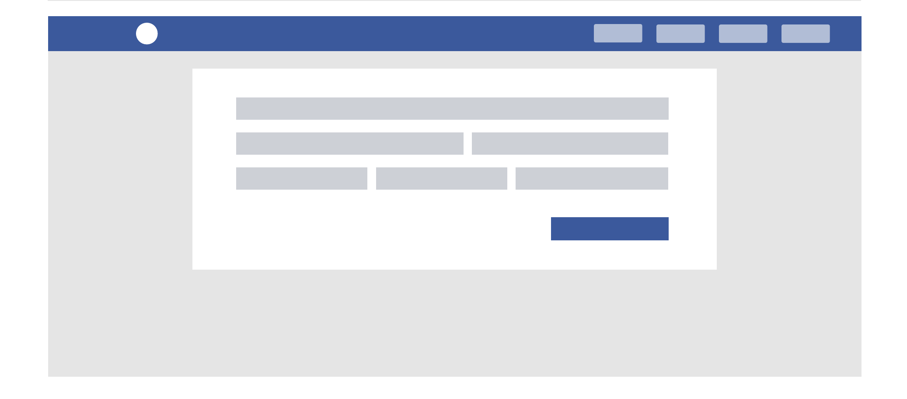

# Teste para desenvolvedor - Vitafor

## Tecnologias a serem utilizadas

-   Laravel
-   SQLite
-   ReactJS

## Aplicação para exibir personagens

Desenvolva uma aplicação que irá consumir a API do [Rick and Morty](https://rickandmortyapi.com/) e irá apresentar a estrutura/menu abaixo:

-   Home
-   Personagens
-   Sobre
-   Login / Cadastro

## Páginas da aplicação

**HOME**

A Home deverá conter uma listagem de personagens vindos diretamente da [API](https://rickandmortyapi.com/), o layout da tela deverá ser o seguinte:

Eles devem estar dispostos como uma lista de cards que permitem que o usuário clique e abra uma página de maiores detalhes do personagem, página de detalhes do personagem.

**DETALHES DO PERSONAGEM**

Esta página deverá seguir o seguinte layout:

O botão do canto inferior direito deve permitir que o usuário salve esse personagem à um banco de dados local, as informações que deverão ser salvas são:

    { name, species, image, url, created_at, updated_at }

Caso essa tela tenha sido aberta vindo da HOME, o botão deverá estar visível e as informações exibidas serão as vindas da API, caso ela tenha sido aberta vindo da página de personagens o botão não ficará disponível e as informações à serem exibidas serão as que estão salvas no banco de dados local. As informações que serão exibidas vindas da API são:

    { name, species, gender, location, image, url }

Caso o personagem já esteja salvo no banco de dados local, esta tela deverá permitir que o usuário exclua o registro e edite as informações.

**PERSONAGENS**

Está tela deverá ser similar à HOME com diferença de que apenas irá exibir os personagens que já estão salvos no banco de dados local. Também deverá permitir a visualização de detalhes ao clicar no personagem, direcionando assim para a tela de DETALHES DO PERSONAGEM.

**SOBRE**

Está deverá ser uma página livre, onde você irá apresentar um mini currículo seu. Aqui você irá se apresentar, por links para sites que você desenvolveu, projetos e tudo que você achar interessante nos mostrar.

**LOGIN / CADASTRO**

O usuário deverá poder se cadastrar e logar com o cadastro realizado. O usuário só poderá salvar um personagem caso ele esteja logado no sistema, caso não esteja e clique no botão para salvar o personagem, ele deve ser direcionado para a tela de LOGIN / CADASTRO.

### Tela de login

### Tela de cadastro

